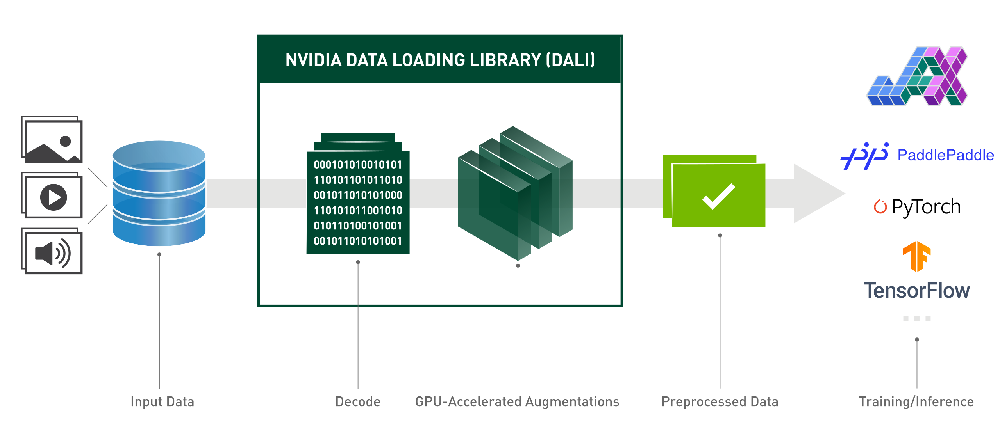

##### **NOTE:** `dali_backend` is available in `tritonserver-20.11` and later

 :exclamation: **IMPORTANT** :exclamation:

`dali_backend` is new and rapidly growing. Official `tritonserver` releases might be behind
on some features and bug fixes. We encourage you to use the latest version of `dali_backend`.
[Docker build](#docker_build) section explains, how to build a `tritonserver` docker
image with `main` branch of `dali_backend` and DALI nightly release. This is a way to
get daily updates!

# DALI TRITON Backend

This repository contains code for DALI Backend for Triton Inference Server.

**NVIDIA DALI (R)**, the Data Loading Library, is a collection of highly optimized building blocks,
and an execution engine, to accelerate the pre-processing of the input data for deep learning applications.
DALI provides both the performance and the flexibility to accelerate different data pipelines as one library.
This library can then be easily integrated into different deep learning training and inference applications,
regardless of used deep learning framework.

To find out more about DALI please refer to our [main page](https://developer.nvidia.com/DALI).
[Getting started](https://docs.nvidia.com/deeplearning/dali/user-guide/docs/examples/getting%20started.html#Getting-started)
and [Tutorials](https://docs.nvidia.com/deeplearning/dali/user-guide/docs/examples/index.html)
will guide you through your first steps and [Supported operations](https://docs.nvidia.com/deeplearning/dali/user-guide/docs/supported_ops.html)
will help you put together GPU-powered data processing pipelines.

## See any bugs?
Feel free to post an issue here or in DALI's [github repository](https://github.com/NVIDIA/DALI).

## How to use?

1. DALI data pipeline is expressed within Triton as a
[Model](https://github.com/triton-inference-server/server/blob/master/docs/architecture.md#models-and-schedulers).
To create such Model, you have to put together a [DALI
Pipeline](https://docs.nvidia.com/deeplearning/dali/master-user-guide/docs/examples/getting%20started.html#Pipeline)
in Python. Then, you have to serialize it (by calling the
[Pipeline.serialize](https://docs.nvidia.com/deeplearning/dali/master-user-guide/docs/pipeline.html#nvidia.dali.pipeline.Pipeline.serialize)
method) or use the [Autoserialization](#Autoserialization) to generate a Model file. As an example, we'll use simple
resizing pipeline:

        import nvidia.dali as dali
        from nvidia.dali.plugin.triton import autoserialize

        @autoserialize 
        @dali.pipeline_def(batch_size=256, num_threads=4, device_id=0)
        def pipe():
            images = dali.fn.external_source(device="cpu", name="DALI_INPUT_0")
            images = dali.fn.image_decoder(images, device="mixed")
            images = dali.fn.resize(images, resize_x=224, resize_y=224)
            return images

1. Model file shall be incorporated in Triton's [Model
Repository](https://github.com/triton-inference-server/server/blob/master/docs/model_repository.md).
Here's the example:

        model_repository
        └── dali
            ├── 1
            │   └── model.dali
            └── config.pbtxt

1. As it's typical in Triton, your DALI Model file shall be named `model.dali`.
You can override this name in the model configuration, by setting `default_model_filename` option.
Here's the whole `config.pbtxt` we use for the `ResizePipeline` example:

        name: "dali"
        backend: "dali"
        max_batch_size: 256
        input [
        {
            name: "DALI_INPUT_0"
            data_type: TYPE_UINT8
            dims: [ -1 ]
        }
        ]

        output [
        {
            name: "DALI_OUTPUT_0"
            data_type: TYPE_FP32
            dims: [ 224, 224, 3 ]
        }
        ]

## Autoserialization

When using DALI Backend in Triton, user has to provide a DALI model in the Model Repository.
A canonical way of expressing a model is to include a serialized DALI model file there and
naming the file properly (``model.dali`` by default). The issue that arises from storing model
in a serialized file is that, after serialization, the model is obscure and almost impossible
to read anymore. Autoserialization feature allows user to express the model in Python code in
the model repository. With the Python-defined model, DALI Backend uses internal serialization
mechanism and exempts user from manual serialization.

To use the autoserialization feature, user needs to put a Python-definition of the DALI pipeline
inside the model file (``model.dali`` by default, but the default file name can be configured
in the ``config.pbtxt``). Such pipeline definition has to be decorated with ``@autoserialize``,
e.g.:

    import nvidia.dali as dali

    @dali.plugin.triton.autoserialize
    @dali.pipeline_def(batch_size=3, num_threads=1, device_id=0)
    def pipe():
        '''
        An identity pipeline with autoserialization enabled
        '''
        data = dali.fn.external_source(device="cpu", name="DALI_INPUT_0")
        return data

Proper DALI pipeline definition in Python, together with autoserialization, shall meet the
following conditions:
1. Only a ``pipeline_def`` can be decorated with ``autoserialize``.
2. Only one pipeline definition may be decorated with ``autoserialize`` in a given model version.

While loading a model file, DALI Backend follows the precedence:
1. First, DALI Backend tries to load a serialized model from the user-specified model location in ``default_model_filename`` property (``model.dali`` if not specified explicitly);
2. If the previous fails, DALI Backend tries to load and autoserialize a Python pipeline
definition from the user-specified model location. **Important**: In this case we require, that the file name with the model definition ends with ``.py``, e.g. ``mymodel.py``;
3. If the previous fails, DALI Backend tries to load and autoserialize a Python pipeline
definition from the ``dali.py`` file in a given model version.

If you did not tweak a model path definition in the `config.pbtxt` file, you should follow the rule of thumb:
1. If you have a serialized pipeline, call the file `model.dali` and put it into the model repository,
2. If you have a python definition of a pipeline, which shall be autoserialized, call it `dali.py`.

## Tips & Tricks:
1. Currently, the only way to pass an input to the DALI pipeline from Triton is to use the `fn.external_source` operator.
Therefore, there's a high chance, that you'll want to use it to feed the encoded images (or any other data) into DALI.
2. Give your `fn.external_source` operator the same name you give to the Input in `config.pbtxt`.

## Known limitations:
1. DALI's `ImageDecoder` accepts data only from the CPU - keep this in mind when putting together your DALI pipeline.
1. Triton accepts only homogeneous batch shape. Feel free to pad your batch of encoded images with zeros
1. Due to DALI limitations, you might observe unnaturally increased memory consumption when
defining instance group for DALI model with higher `count` than 1. We suggest using default instance
group for DALI model.

## How to build?

### Docker build 
Building DALI Backend with docker is as simple as:

    git clone --recursive https://github.com/triton-inference-server/dali_backend.git
    cd dali_backend
    docker build -f docker/Dockerfile.release -t tritonserver:dali-latest .

And `tritonserver:dali-latest` becomes your new `tritonserver` docker image

### Bare metal
#### Prerequisites
To build `dali_backend` you'll need `CMake 3.17+`
#### Using fresh DALI release
On the event you'd need to use newer DALI version than it's provided in `tritonserver` image,
you can use DALI's [nightly builds](https://docs.nvidia.com/deeplearning/dali/user-guide/docs/installation.html#nightly-and-weekly-release-channels).
Just install whatever DALI version you like using pip (refer to the link for more info how to do it).
In this case, while building `dali_backend`, you'd need to pass `-D TRITON_SKIP_DALI_DOWNLOAD=ON`
option to your CMake build. `dali_backend` will find the latest DALI installed in your system and
use this particular version.
#### Building
Building DALI Backend is really straightforward. One thing to remember is to clone
`dali_backend` repository with all the submodules:

    git clone --recursive https://github.com/triton-inference-server/dali_backend.git
    cd dali_backend
    mkdir build
    cd build
    cmake ..
    make

The building process will generate `unittest` executable.
You can use it to run unit tests for DALI Backend

