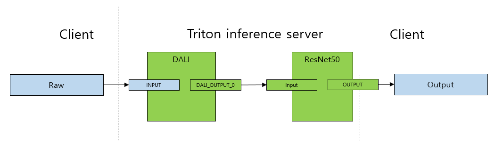

# Triton Inference Server with DALI backend

This is an example of [DALI (Data Loading Library) backend](https://github.com/NVIDIA/DALI) for image classification on [Triton Inference Server](https://github.com/triton-inference-server/server).

The classification is performed on the ResNet50 model, which is optimized by [TensorRT](https://developer.nvidia.com/tensorrt).


#### Prerequisites

* Export ONNX and build TensorRT
  * `nvcr.io/nvidia/pytorch:21.07-py3`
* Triton Inference Server with DALI Backend
  * `nvcr.io/nvidia/tritonserver:21.07-py3`
  * `https://github.com/triton-inference-server/dali_backend`. DALI Backend is included out-of-the-box in `tritonserver`, starting from `20.11` release.

* Client
  * `nvcr.io/nvidia/tritonserver:21.07-py3-sdk`

## Quick setup (recommended)

The quickest way to set up this example is to run the setup script:

```
cd dali_backend/docs/examples/resnet50_trt
sh setup_resnet50_trt_example.sh
```

Below we add step-by-step guide, how to set up and run this example.

### Step-by-step guide (optional)

If you used the `setup_resnet50_trt_example.sh` script, please skip to
[Run Triton Inference Server](#run-triton-inference-server) section.

Prepare directory structure for the model repository.

```
mkdir -p model_repository/dali/1
mkdir -p model_repository/ensemble_dali_resnet50/1
mkdir -p model_repository/resnet50_trt/1
```

####  Build TensorRT via ONNX

##### 1.  Converting PyTorch Model to ONNX-model 

Run `onnx_exporter.py` to convert ResNet50 PyTorch model to ONNX format. `width` and `height` dims are fixed at 224 but dynamic axes arguments for dynamic batch are used. Commands from the `2.` and `3.` subsections shall be executed within this docker container.

```
docker run -it --gpus=all -v $(pwd):/workspace nvcr.io/nvidia/pytorch:21.07-py3 bash
python onnx_exporter.py --save model.onnx
```

##### 2. Building ONNX-model to TensorRT engine

Set the arguments for enabling fp16 precision `--fp16`. To enable dynamic shapes use `--minShapes`, `--optShapes`, and `maxShapes` with `--explicitBatch`:

```python
trtexec --onnx=model.onnx --saveEngine=./model_repository/resnet50_trt/1/model.plan --explicitBatch --minShapes=input:1x3x224x224 --optShapes=input:1x3x224x224 --maxShapes=input:256x3x224x224 --fp16
```

##### 3. Serialize DALI pipeline 

Run `serialize_dali_pipeline.py` to generate DALI pipeline. In this script you can find details of how DALI pipeline looks like and how to serialize it from the python level.

```
python serialize_dali_pipeline.py --save ./model_repository/dali/1/model.dali
```


## Run Triton Inference Server



The listing below visualizes, how should the model_repository look like, after proper setup:

```bash
model_repository
├── dali
│   ├── 1
│   │   └── model.dali
│   └── config.pbtxt
├── ensemble_dali_resnet50
│   ├── 1
│   └── config.pbtxt
└── resnet50_trt
    ├── 1
    │   └── model.plan
    ├── config.pbtxt
    └── labels.txt
```

Run the Triton server

```
docker run --gpus=all --rm -p8000:8000 -p8001:8001 -p8002:8002 -v$(pwd):/workspace/ -v/$(pwd)/model_repository:/models nvcr.io/nvidia/tritonserver:21.07-py3 tritonserver --model-repository=/models
```

## Request image classification

Create gRPC client via URL

```python
triton_client = tritongrpcclient.InferenceServerClient(url=args.url, verbose=False)
```

Load raw image from `numpy` and configurate input and output with the name, shape and datatype. 

```
inputs = []
outputs = []
input_name = "INPUT"
output_name = "OUTPUT"
image_data = load_image(args.image)
image_data = np.expand_dims(image_data, axis=0)

inputs.append(tritongrpcclient.InferInput(input_name, image_data.shape, "UINT8"))
outputs.append(tritongrpcclient.InferRequestedOutput(output_name))

inputs[0].set_data_from_numpy(image_data)
```

Request inference and obtain the results

```python
results = triton_client.infer(model_name=args.model_name,
                                    inputs=inputs,
                                    outputs=outputs)
output0_data = results.as_numpy(output_name)
```

Run `client.py` with the path to image `--image`

```bash
wget https://raw.githubusercontent.com/triton-inference-server/server/master/qa/images/mug.jpg -O "mug.jpg"
docker run --rm --net=host -v $(pwd):/workspace/ nvcr.io/nvidia/tritonserver:21.07-py3-sdk python client.py --image mug.jpg 
0.02642226219177246ms class:COFFEE MUG
```

